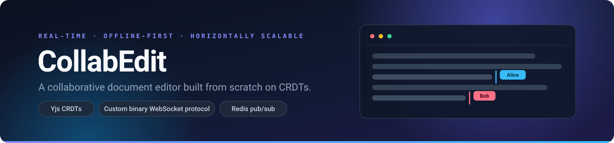
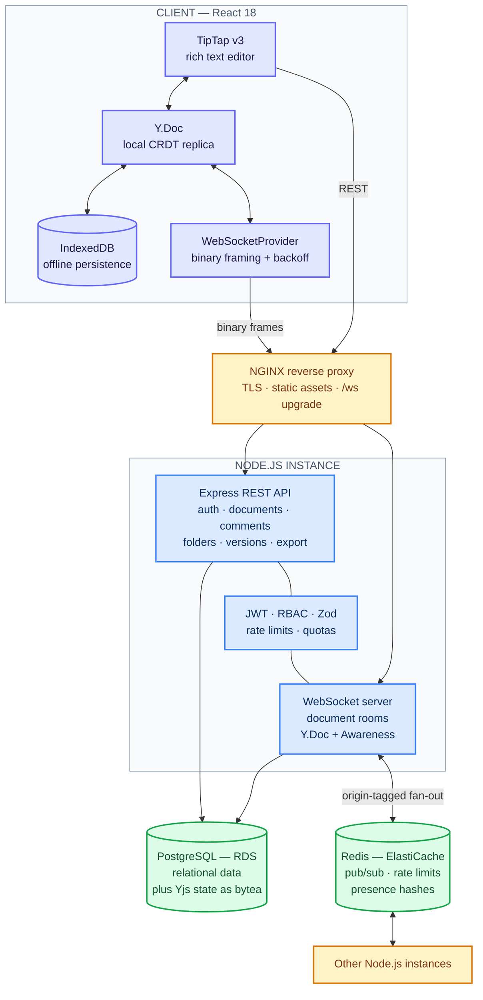
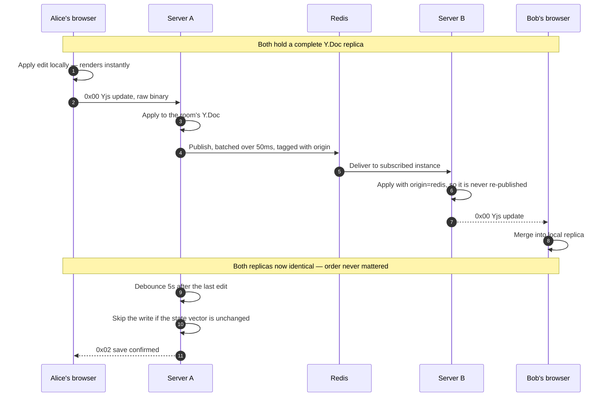
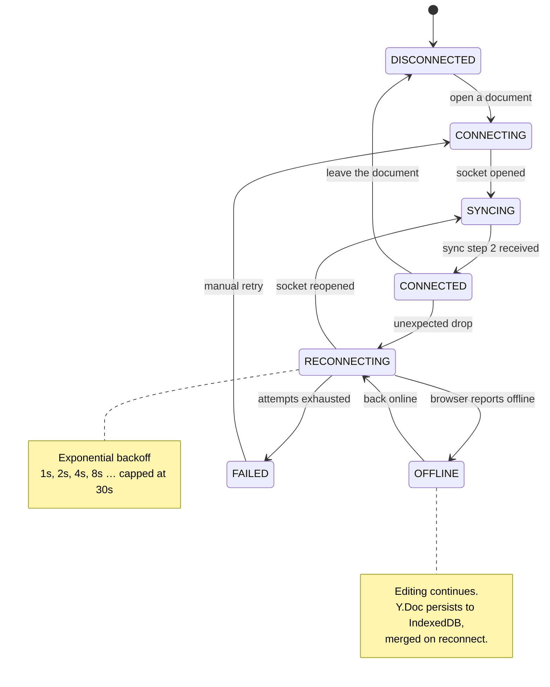
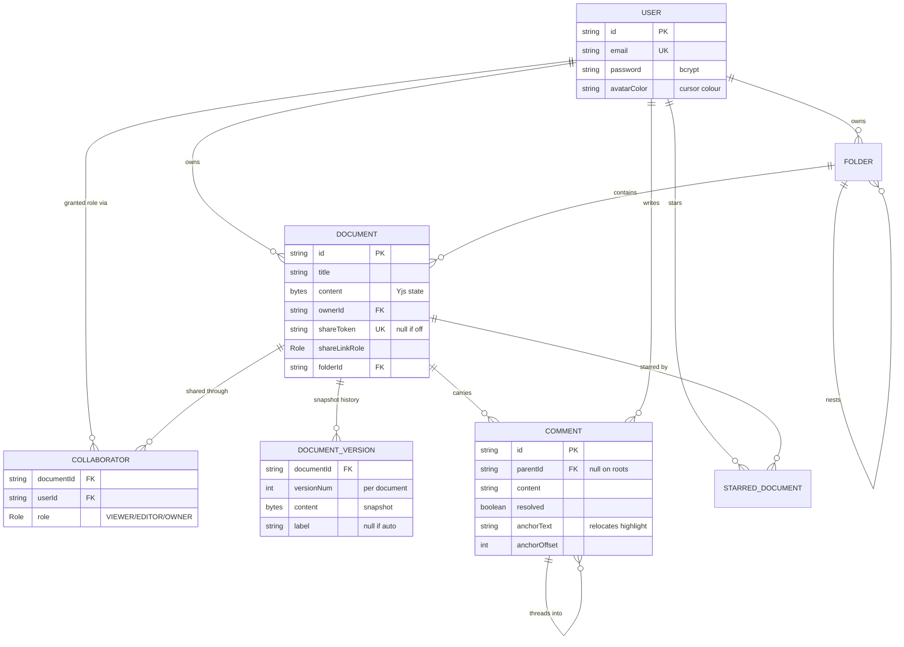

<div align="center">



<br>

**A production-grade collaborative document editor — Google Docs' core, rebuilt from first principles.**

Two people type in the same paragraph at the same time and nothing breaks. No operational transforms,
no Socket.io, no `y-websocket`. The CRDT layer, the binary wire protocol, and the multi-server fan-out
are all written here.

<br>

[](http://13.127.254.142)
[](#license)
[](loadtest/README.md)

<br>


<br>

[Architecture](#architecture) &nbsp;·&nbsp;
[How sync works](#how-real-time-sync-works) &nbsp;·&nbsp;
[The wire protocol](#the-wire-protocol) &nbsp;·&nbsp;
[Offline](#going-offline-and-coming-back) &nbsp;·&nbsp;
[Data model](#data-model) &nbsp;·&nbsp;
[Quick start](#quick-start) &nbsp;·&nbsp;
[Testing](#testing) &nbsp;·&nbsp;
[Design decisions](#design-decisions)

</div>

<!--
  SCREENSHOT GALLERY — drop images into docs/screenshots/ and uncomment this block.
  Suggested shots, in order of how much they prove:
    1. collaboration.png — two browser windows side by side, both mid-edit, remote cursors
       and the "X is typing…" indicator visible. This one shot justifies the whole project.
    2. editor.png       — a formatted document with the toolbar and the slash-command palette open
    3. dashboard.png    — the document grid with the sidebar (folders, starred, shared with me)
    4. comments.png     — an inline comment thread anchored to highlighted text

<div align="center">
  
  <br><br>
  
  
</div>
-->

---

## Why this one is different

Most "collaborative editor" projects are a Socket.io room that broadcasts the whole document on
every keystroke and calls last-write-wins a merge strategy. This one is built the way a real
system has to be:

|  | |
|---|---|
| **Real CRDT convergence** | Yjs replicas converge regardless of update order, with no server-side sequencer. Proven by a dedicated test suite, not asserted in a README — see [CRDT correctness](#crdt-correctness). |
| **A hand-written binary protocol** | Eight message types over raw `Uint8Array` frames. Yjs payloads are never JSON-wrapped, and the protocol carries things a generic provider has no concept of: live role changes, access revocation, comment events. |
| **Genuinely horizontal** | Redis pub/sub fans updates across server instances, with origin tagging so an applied update never echoes back into an infinite loop. Any instance can accept any update. |
| **Offline as a first-class path** | Local Yjs state in IndexedDB, an explicit connection state machine with exponential backoff, and an automatic CRDT merge on reconnect. Not a "you are offline" banner over a dead editor. |
| **Hardened, not just working** | Tiered rate limiting, per-IP WebSocket guards, quotas, role enforcement at *both* the REST and socket layers, and graceful degradation when Redis disappears. |

---

## Architecture



Redis is a scaling enhancement, never a hard dependency. With it unreachable the app keeps
running in single-server mode, losing only cross-instance collaboration — and the Redis-backed
rate limiter **fails open** rather than 500-ing every request.

---

## How real-time sync works

The interesting question is not "how does text get to the other browser" — it's what happens when
two people edit the same position at the same moment, on two different servers.



**Why order never mattered.** Every Yjs update carries enough identity to be applied
commutatively — the same set of updates produces the same document no matter which order each
replica receives them in, and re-applying one is a no-op. That is the property that makes both
offline editing and multi-server fan-out possible without any coordinator deciding "who went
first".

### CRDT correctness

The convergence claim is tested rather than asserted — see
[`server/src/test/unit/crdt.test.ts`](server/src/test/unit/crdt.test.ts):

| Scenario | Expected |
|---|---|
| Concurrent inserts at the same position | Both survive, in a deterministic order |
| Concurrent delete + insert | The insert survives when it falls outside the deleted range |
| Five replicas editing simultaneously | All five converge to byte-identical state |
| Updates applied out of order | Same final document regardless of arrival order |
| Binary encode → decode round-trip | Zero data loss |

```bash
npm run test:crdt
```

---

## The wire protocol

Rather than Socket.io or `y-websocket`, this project defines its own protocol. Every frame is a
raw `Uint8Array` whose leading varuint is the message type — Yjs payloads are never JSON-wrapped,
which keeps serialization cost off the hot path.

<table>
<tr><th>Type</th><th>Name</th><th>Direction</th><th>Payload</th></tr>
<tr><td><code>0x00</code></td><td><b>Sync</b></td><td>↔</td><td>Yjs sync protocol — step 1, step 2, update</td></tr>
<tr><td><code>0x01</code></td><td><b>Awareness</b></td><td>↔</td><td>Cursor, selection, identity, typing flag</td></tr>
<tr><td><code>0x02</code></td><td><b>Save confirmed</b></td><td>→</td><td>Sent after a debounced or periodic DB write</td></tr>
<tr><td><code>0x03</code></td><td><b>Ping</b></td><td>↔</td><td>Echoed back verbatim — a latency probe</td></tr>
<tr><td><code>0x04</code></td><td><b>Document restored</b></td><td>→</td><td>Broadcast after a version restore</td></tr>
<tr><td><code>0x05</code></td><td><b>Role updated</b></td><td>→</td><td>The caller's permission on this document changed</td></tr>
<tr><td><code>0x06</code></td><td><b>Access revoked</b></td><td>→</td><td>The caller lost access entirely</td></tr>
<tr><td><code>0x07</code></td><td><b>Comment event</b></td><td>→</td><td>Comment CRUD notification, JSON payload</td></tr>
</table>

<sup>↔ bidirectional &nbsp;·&nbsp; → server to client only</sup>

The registry lives in
[`server/src/websocket/WebSocketServer.ts`](server/src/websocket/WebSocketServer.ts) and is
mirrored in [`client/src/lib/WebSocketProvider.ts`](client/src/lib/WebSocketProvider.ts).

Types `0x05` and `0x06` are the ones a generic Yjs provider cannot express: **permission changes
land mid-session.** Demote an editor to viewer and their client stops being able to push edits
immediately — no refresh, and the server drops their sync messages regardless of what their UI
believes.

---

## Going offline and coming back

The client runs an explicit connection state machine rather than hoping the socket stays up.



Three things keep edits safe while the socket is down:

1. **IndexedDB** holds the local Yjs state, so a refresh mid-outage loses nothing.
2. **A REST fallback save** kicks in once the socket has been down 10 seconds but HTTP still works
   — a dropped upgrade, a proxy hiccup — persisting on a 2-second debounce.
3. **CRDT merge on reconnect** reconciles whatever changed on both sides. No last-write-wins, no
   conflict prompt, no lost paragraphs.

Keepalive pings adapt to tab visibility: every 30 seconds while the tab is focused, backing off
to 120 seconds when it is hidden.

---

## Data model



The Yjs document state lives in the same database as its permissions, as a `bytea` column — so a
document and who may read it commit together. Auto-snapshots prune past 50 per document; labelled
snapshots are never pruned.

---

## Features

<details open>
<summary><b>Real-time collaboration</b></summary>
<br>

- **Live cursors and selections** with animated movement and auto-fading name labels
- **Typing indicators** driven by debounced awareness updates
- **Avatar bar** — click a collaborator to jump the editor straight to their cursor
- **Participants panel with follow mode** — pin to a user and track their cursor as they move
- **Join / leave toasts**, debounced so a brief reconnect blip doesn't spam the room
- Awareness updates throttled to ~10 publishes per second before crossing the Redis hop; local
  broadcasts are always immediate

</details>

<details>
<summary><b>Rich text editing</b></summary>
<br>

- **TipTap v3** (ProseMirror) — bold, italic, underline, strikethrough, headings, ordered and
  bulleted lists, task lists, code blocks, blockquotes, images, links, highlight colours, text
  alignment, horizontal rules
- **Slash commands** — type `/` for a Notion-style command palette
- Link bubble menu, live word and character count in the status bar
- Keyboard shortcuts throughout, with a `Ctrl+/` cheat sheet

</details>

<details>
<summary><b>Comments</b></summary>
<br>

- **Inline comments** anchored to a text selection, rendered as a highlight mark in the editor
- **Threaded replies**, resolve and unresolve
- Real-time sync to every connected client over the socket, not by polling
- Anchors carry a text snippet plus offset, relocated best-effort as the document drifts

</details>

<details>
<summary><b>Version history</b></summary>
<br>

- Named snapshots plus automatic ones as the document evolves
- Preview any version, then restore it — the restore broadcasts live to everyone in the room
- Auto-snapshots prune past 50 per document; labelled snapshots survive forever
- The pre-restore state is always captured as a labelled snapshot, so a restore is never
  destructive

</details>

<details>
<summary><b>Access control and sharing</b></summary>
<br>

- **OWNER / EDITOR / VIEWER** roles enforced on the REST routes *and* the WebSocket layer — a
  viewer's sync messages are answered so their replica stays current, but never applied
- **Share links** with a configurable role and one-click acceptance
- Live role-updated and access-revoked pushes, so permission changes land mid-session
- Caps: 50 collaborators per document, 500 comments per document, 500 documents and 100 folders
  per user

</details>

<details>
<summary><b>Organisation, search and export</b></summary>
<br>

- Nested **folders**, per-user **starring**, debounced search on `Ctrl+K`
- Dashboard views: All, Starred, Shared with me, Recent
- Export to **PDF** (server-side Puppeteer), **Markdown** (Turndown with custom rules for task
  lists and highlights), and styled **HTML**

</details>

<details>
<summary><b>Security, hardening and monitoring</b></summary>
<br>

- **JWT auth** with access + refresh tokens and transparent client-side refresh
- **Tiered rate limiting** on a Redis store — general 100/min, auth 10 per 15 min per IP,
  document creation 20/hr, exports 10 per 10 min, comments 30/min
- **WebSocket guards** — 20 concurrent connections per IP, 10 new per minute, 50 msg/s soft and
  100 msg/s hard limits, 2 MB max frame, 5 MB max document, 30-minute idle sweep
- Helmet, CORS allow-listing, gzip compression, Zod validation on every route
- **Admin dashboard** at `/admin` with live connection, room, throughput, latency and memory
  charts, gated by `ADMIN_EMAILS`

</details>

---

## Tech Stack

| Layer | Choice | Why this one |
|---|---|---|
| **Frontend** | React 18 · TypeScript · Tailwind CSS | Type-safe, utility-first, fast to iterate |
| **Editor** | TipTap v3 (ProseMirror) | Headless and extensible, first-class Yjs binding |
| **CRDT** | Yjs + y-protocols | Compact binary encoding, awareness protocol included |
| **Offline** | y-indexeddb | Local Yjs persistence with no extra sync logic |
| **State** | Zustand | Minimal boilerplate, strong inference, no provider tree |
| **Server** | Node.js 20 · Express · TypeScript | One language across the stack, async I/O suits sockets |
| **WebSocket** | `ws` + a hand-written binary protocol | Full control of framing, direct Redis integration |
| **Database** | PostgreSQL 16 (AWS RDS) | ACID, relational access control, `bytea` for Yjs state |
| **ORM** | Prisma | Type-safe queries, migrations, cascade rules in schema |
| **Cache / pub-sub** | Redis 7 (AWS ElastiCache) | Sub-millisecond fan-out, rate limiting, presence |
| **Testing** | Vitest · Supertest | ESM-native, fast, good DX |
| **Load testing** | k6 | Scriptable, threshold-gated, CI-friendly |
| **Deploy** | Docker · Nginx · AWS EC2 | Multi-stage builds, TLS termination, managed data tier |

---

## Quick start

**Prerequisites:** Node.js 20+, Docker and Docker Compose.

```bash
git clone https://github.com/Ashishayu100/collab-editor.git
cd collab-editor

npm run docker:dev          # PostgreSQL 16 + Redis 7 in containers
npm install
cp .env.example server/.env # the comments in that file explain every value

npm run prisma:migrate
npm run db:seed             # optional demo data — see below
npm run dev                 # client + server together
```

| | |
|---|---|
| **Client** | http://localhost:5173 |
| **Server** | http://localhost:3001 |
| **Demo accounts** | `alice@demo.com` · `bob@demo.com` · `carol@demo.com` — password `demo1234` |

The Vite dev proxy makes API and WebSocket calls same-origin, so there are no `VITE_*` URL
variables to configure. To actually *see* the point of the project, open the app in two browsers
(one incognito), share a document between the accounts, and type in both at once.

<details>
<summary><b>Running the full stack in Docker</b></summary>
<br>

```bash
npm run docker:build
npm run docker:up     # http://localhost
```

Builds the multi-stage server and client images and runs them alongside PostgreSQL and Redis.

</details>

<details>
<summary><b>Deploying to AWS</b></summary>
<br>

EC2 + RDS + ElastiCache behind an Nginx reverse proxy, with the app containerised.

- [`deployment/aws/QUICK_START.md`](deployment/aws/QUICK_START.md) — the short path
- [`deployment/aws/SETUP.md`](deployment/aws/SETUP.md) — provisioning each resource in full
- [`deployment/aws/deploy.sh`](deployment/aws/deploy.sh) — one-command redeploy
- [`deployment/aws/setup-ssl.sh`](deployment/aws/setup-ssl.sh) — Let's Encrypt, once a domain points at the box

Operational scripts for health checks, backups, and log tailing live in
[`deployment/aws/scripts/`](deployment/aws/scripts/).

</details>

---

## Testing

```bash
npm test                  # everything
npm run test:unit         # validators, JWT, hashing, limits, Yjs utils, CRDT
npm run test:integration  # REST endpoints, access control, sharing, WebSocket
npm run test:crdt         # CRDT merge correctness only
npm run test:coverage
```

Integration tests run against a separate `collab_test` database, kept isolated from development
data — see `TEST_DATABASE_URL` in `.env.example`.

### Load testing

Three [k6](https://k6.io) scripts live in [`loadtest/`](loadtest/):

| Script | What it measures |
|---|---|
| [`api-load-test.js`](loadtest/api-load-test.js) | Full REST document lifecycle, ramping 10 → 25 → 50 concurrent users |
| [`ws-load-test.js`](loadtest/ws-load-test.js) | Concurrent collaboration sessions — handshake latency, room lifecycle, ping round-trip |
| [`health-stress-test.js`](loadtest/health-stress-test.js) | Raw request ceiling at 50 → 100 VUs, exercising both connection pools |

```bash
npm run loadtest:api
```

> [!IMPORTANT]
> Read [`loadtest/README.md`](loadtest/README.md) first. Every limit in this app is keyed by IP or
> by user, and a load generator is one IP creating throwaway users — so the API and WebSocket
> scripts need the server started with `LOAD_TEST_MODE=true`, or the run measures the rate limiter
> instead of the application. That flag must never be left on for an internet-facing deployment.

---

## Design decisions

<details>
<summary><b>1. CRDTs over operational transforms</b></summary>
<br>

OT needs a central server to order operations — every client's edit has to be transformed against
every concurrent edit, in a sequence somebody has to decide. CRDTs converge without coordination,
which is what makes offline editing and multi-instance fan-out possible at all: any server can
accept any update in any order and still land on the same document.

</details>

<details>
<summary><b>2. A custom WebSocket protocol over Socket.io or y-websocket</b></summary>
<br>

Full control of the binary framing, no framework overhead, and room state that plugs straight into
Redis pub/sub. It also made room for protocol-level features a generic provider has no concept of:
live role changes, access revocation, and comment events sharing the same socket rather than
needing a second channel.

</details>

<details>
<summary><b>3. PostgreSQL over a document store</b></summary>
<br>

The interesting data here is relational — users, collaborators, roles, threaded comments — and
benefits from real transactions and cascade rules expressed in the schema. Yjs state lives
alongside it as a `bytea` column, so a document and its permissions commit together instead of
drifting across two systems.

</details>

<details>
<summary><b>4. Redis pub/sub over a durable broker</b></summary>
<br>

No durability is needed for the fan-out: Yjs already guarantees convergence, so a dropped message
costs nothing once the next sync runs. That leaves latency as the only metric that matters, and
Redis wins it — while doing double duty as the rate-limit store and the presence tracker.

</details>

<details>
<summary><b>5. TipTap v3 over Quill or Slate</b></summary>
<br>

ProseMirror underneath, with a maintained Yjs binding and an extension API clean enough to add
comment-highlight marks and a slash-command menu without forking anything.

</details>

<details>
<summary><b>6. Graceful degradation everywhere</b></summary>
<br>

Redis down → single-server mode. Rate-limit store unreachable → fail open rather than 500. Socket
down → REST fallback saves and local IndexedDB persistence. None of these turn an infrastructure
hiccup into an outage, which is the difference between a demo and a system.

</details>

---

## Performance budgets

These are the system's **configured budgets and design targets**, not benchmark results. The k6
scripts are how you produce real numbers for a given deployment.

| Path | Budget |
|---|---|
| Local edit → on screen | Immediate — Yjs applies locally before anything is sent |
| Same-server broadcast | Sent on the update event, unbatched |
| Cross-server fan-out | Up to 50 ms batch window, plus one Redis hop |
| Awareness across servers | Throttled to ~10 publishes/sec per document |
| Document persistence | 5 s debounce after the last edit, 30 s periodic backstop |
| Reconnect backoff | 1 s doubling to a 30 s ceiling |
| REST p95 | < 500 ms threshold, enforced by the load tests |
| WebSocket handshake p95 | < 2 s (JWT verify + access check + room load + initial sync) |

---

## Project structure

<details>
<summary><b>Expand the tree</b></summary>
<br>

```
collab-editor/
├── client/                       React frontend (Vite)
│   └── src/
│       ├── api/                  Axios instance w/ refresh interceptor + endpoint modules
│       ├── components/
│       │   ├── editor/           TipTap editor, toolbar, cursors, panels, dialogs
│       │   ├── comments/         Comments panel
│       │   ├── dashboard/        Sidebar, move-to-folder dialog
│       │   ├── admin/            Metric cards
│       │   └── ui/               Buttons, inputs, skeletons, toasts, confirm dialogs
│       ├── extensions/           Custom TipTap extension (slash commands)
│       ├── hooks/                Awareness, versions, IndexedDB sync, presence toasts
│       ├── lib/                  WebSocketProvider, Yjs helpers, colours, export helpers
│       ├── pages/                Landing, auth, dashboard, editor, admin, share accept
│       └── stores/               Zustand stores (auth, documents, comments, folders, toasts)
├── server/                       Node.js backend
│   ├── src/
│   │   ├── routes/               Express routers
│   │   ├── controllers/          Request handlers
│   │   ├── services/             Domain logic, Redis pub/sub, metrics, presence tracker
│   │   ├── middleware/           Auth, RBAC, validation, rate limiting, quotas, metrics
│   │   ├── websocket/            Custom WebSocket server + registry
│   │   ├── config/               Env schema, database, Redis, hardening limits
│   │   ├── utils/                JWT, hashing, Yjs helpers, error types
│   │   ├── test/                 unit/ + integration/ suites
│   │   ├── app.ts                Express app factory (supertest-friendly)
│   │   └── index.ts              HTTP + WebSocket + Redis lifecycle
│   └── prisma/                   Schema, migrations, seed
├── shared/                       Types shared across client and server
├── loadtest/                     k6 scripts + results
├── deployment/aws/               EC2/RDS/ElastiCache setup, Nginx, deploy + ops scripts
├── docs/assets/                  README artwork
├── docker-compose.yml            Full stack
├── docker-compose.dev.yml        Dev infrastructure only
└── Makefile                      Developer shortcuts
```

</details>

## Further reading

| Document | What it covers |
|---|---|
| [`loadtest/README.md`](loadtest/README.md) | Running k6, what the thresholds mean, cleaning up test data |
| [`DEMO_GUIDE.md`](DEMO_GUIDE.md) | A shot-by-shot script for recording a demo of the app |
| [`VERIFICATION.md`](VERIFICATION.md) | End-to-end checklist for verifying a deployment |
| [`deployment/aws/SETUP.md`](deployment/aws/SETUP.md) | Provisioning the AWS infrastructure from scratch |

---

## License

Released under the [MIT License](LICENSE).

<div align="center">
<br>

**Built by Ashish** &nbsp;·&nbsp; IIT Patna

[](https://github.com/Ashishayu100)

<sub>If this was useful or interesting, a ⭐ is always appreciated.</sub>

</div>
